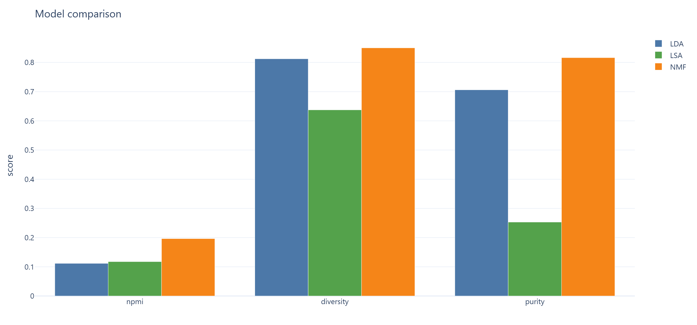
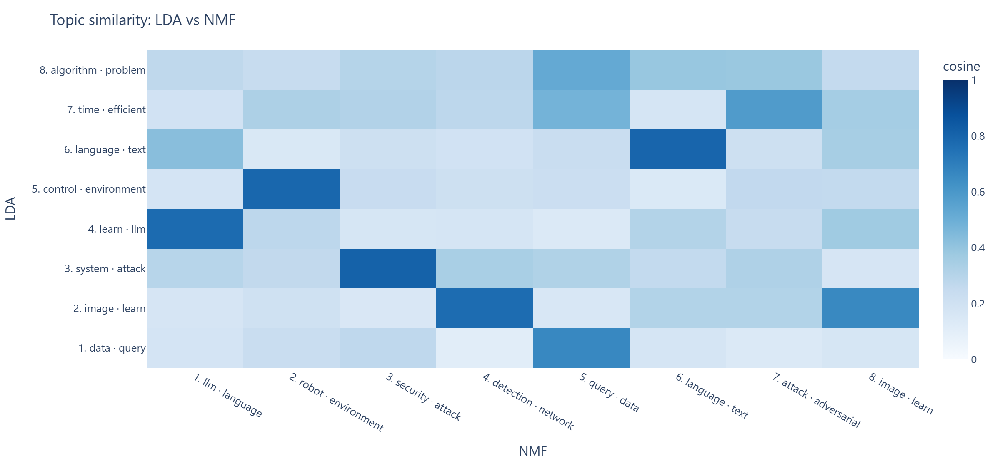
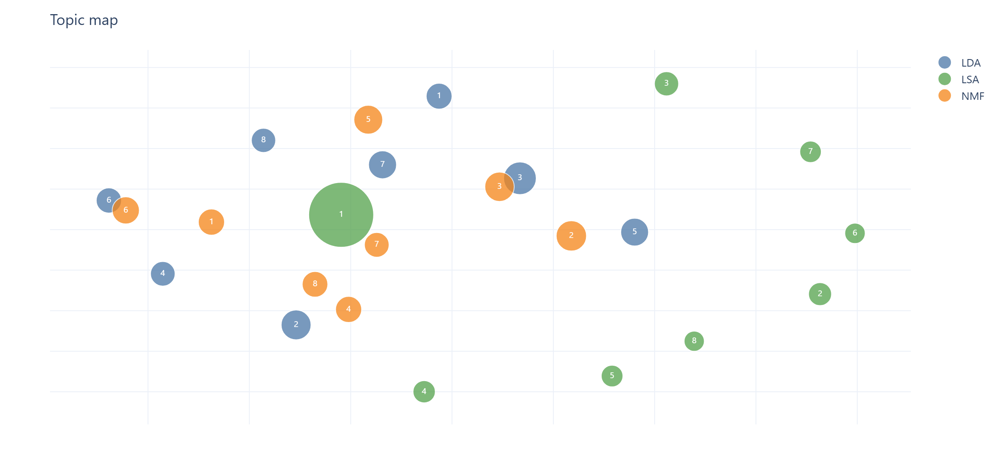
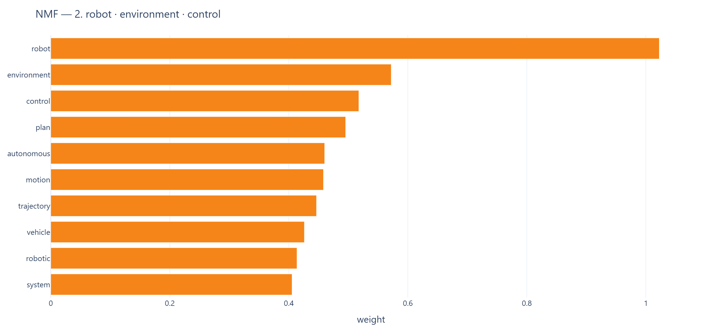
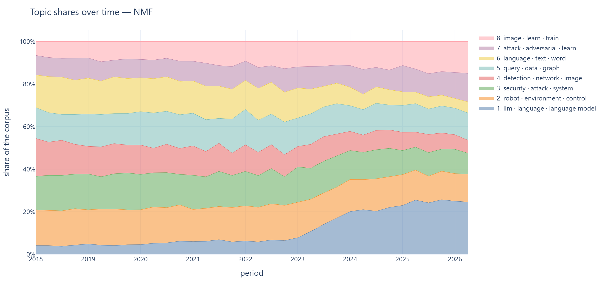
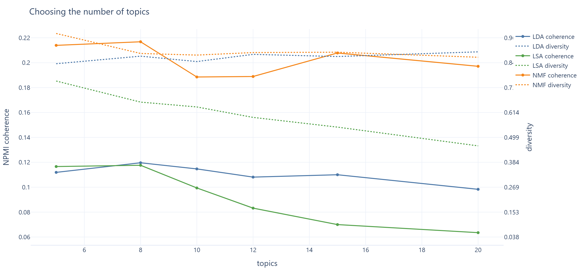

**[English Version / На английском](README.md)**

# TopicLens

[](https://www.python.org/)
[](https://streamlit.io/)
[](https://github.com/IlyaShaposhnikov/topic-lens/actions)
[](LICENSE)
[](https://topic-lens.streamlit.app/)

**LDA, NMF и LSA обучаются на одном корпусе и сравниваются по когерентности, разнообразию тем и согласию с реальными категориями — а не по тому, насколько правдоподобно выглядят их топ-слова.**

Обычно проект по тематическому моделированию обучает одну модель и печатает десять списков слов. Здесь обучаются три, измеряются друг против друга, их темы сопоставляются попарно, и отслеживается, как темы менялись за восемь лет аннотаций arXiv.

**[Демо](https://topic-lens.streamlit.app/)** — работает на стратифицированной выборке из 2487 аннотаций, поэтому его метрики ниже тех, что приведены далее. Полный корпус — 20 169 аннотаций по пяти категориям arXiv, январь 2018 — июнь 2026.

## На какие вопросы отвечает

| Вопрос | Чем |
|---|---|
| Какая модель дает более качественные темы? | Когерентность NPMI и UMass, разнообразие тем, попарное перекрытие |
| Значат ли темы что-то реальное? | Согласие с категорией arXiv самой статьи (NMI, ARI, чистота) |
| Нашли ли три модели одну и ту же структуру? | Косинусная близость векторов тем, паросочетание венгерским алгоритмом |
| Сколько должно быть тем? | Перебор k по когерентности и разнообразию с измерением шума по зернам |
| Что изменилось за восемь лет? | Доли тем по кварталам на всем корпусе |

## Результаты

Полный корпус, 8 тем на модель, одинаковая предобработка, фиксированное зерно.



| | LDA | NMF | LSA |
|---|---|---|---|
| **Когерентность NPMI** ↑ | 0,112 | **0,196** | 0,118 |
| **Когерентность UMass** ↑ | −1,891 | **−1,656** | −2,004 |
| **Разнообразие тем** ↑ | 0,813 | **0,850** | 0,638 |
| **Попарное перекрытие** ↓ | 0,046 | **0,029** | 0,084 |
| **NMI с категориями** ↑ | 0,395 | **0,548** | 0,083 |
| **ARI с категориями** ↑ | 0,381 | **0,524** | 0,004 |
| **Чистота** ↑ | 0,706 | **0,816** | 0,253 |
| **Время обучения** | 286 с | 46 с | **1,3 с** |

**NMF выигрывает по всем метрикам качества.** Его темы самые когерентные, меньше всех пересекаются и заметно ближе к настоящим категориям: в 82% случаев доминирующая тема статьи совпадает с преобладающей категорией этой темы.

**LSA — не модель тем, и числа говорят об этом прямо.** Чистота 0,253 едва превышает 0,20, которые дает случайное распределение по пяти сбалансированным категориям, а ARI 0,004 означает полное отсутствие согласия после поправки на случайность. Его первая компонента — не тема, а «средняя научная аннотация», то есть направление максимальной дисперсии, которое SVD и предназначен находить. В сравнении он оставлен именно потому, что такой провал информативен, а в приложении он занят делом — **поиском похожих статей**, для которого метод действительно хорош.

**Две модели из трех согласны друг с другом.** Средняя близость оптимально сопоставленных тем: LDA↔NMF **0,680**, LSA↔NMF 0,388, LDA↔LSA 0,314.



LDA и NMF независимо нашли одну и ту же тему компьютерного зрения (косинус 0,91, восемь общих слов из десяти) и одну и ту же тему робототехники (0,89) — обучаясь на разных матрицах с разными целевыми функциями.



Все 24 темы трех моделей спроецированы вместе таким образом, чтобы расстояния между ними были сопоставимы для разных моделей. Темы LDA (синие) и NMF (оранжевые) перемежаются — они обнаружили одну и ту же структуру. LSA (зеленая) находится особняком, а ее первая компонента — это крупная точка: четверть корпуса, отнесенная к тому, что по сути является «средней научной аннотацией».

### Как выглядит тема



Тема — это взвешенный список слов; подпись, которая используется в приложении и отчётах, состоит просто из трёх ведущих.

## Темы смещаются



Тема больших языковых моделей растет с 4% корпуса до 25%, перелом приходится на 2023 год. Следом подтягивается безопасность — работы об атаках на языковые модели.

**Это сдвиг в том, о чем пишут статьи, а не рост их количества.** Корпус по построению содержит ровно 40 статей на категорию в месяц, то есть размеры направлений зафиксированы. Те же 40 ежемесячных статей `cs.CL` в 2018 году были про машинный перевод и эмбеддинги, а в 2025-м — про большие языковые модели.

Проверено независимо от моделей, простым подсчетом аннотаций, где вообще упоминаются LLM:

| 2018 | 2019 | 2020 | 2021 | 2022 | 2023 | 2024 | 2025 | 2026 |
|---|---|---|---|---|---|---|---|---|
| 0,0% | 0,0% | 0,2% | 0,3% | 1,2% | 8,9% | 22,4% | 28,1% | 31,0% |

Кривая совпадает с тем, что модель нашла, ничего не зная про LLM.

## Что показали эксперименты

Каждый параметр ниже выбран измерением, и сами измерения не менее интересны, чем выбор.

**Число тем для LDA — в основном шум.** Перебор k от 5 до 20 изменил когерентность LDA на 0,022, тогда как смена только случайного зерна меняет ее на 0,023. Выбирать k по такой кривой означало бы гадать. С NMF наоборот: при инициализации `nndsvda` (которая сама является SVD матрицы) он полностью детерминирован по зернам, поэтому его различия реальны, а максимум приходится на k = 5–8. Для всех трех моделей взято восемь тем, чтобы сравнение оставалось сопоставимым.



### Пять тем или восемь?

Метрики не согласуются между собой, и в этом-то и суть. При k = 5 NMF гораздо лучше соответствует категориям arXiv — чистота 0,844 против 0,816, ARI 0,657 против 0,524, что неудивительно, поскольку для сопоставления имеется ровно пять категорий. При k = 8 когерентность немного выше (0,196 против 0,192), а темы становятся более детальными: единая языковая тема разделяется на большие языковые модели и классическую обработку естественного языка (NLP).

| # | k = 5 | k = 8 |
|---|---|---|
| 1 | language, language model, llm, text, large language, large, word, train, generation, natural | llm, language, language model, large language, reason, large, model llm, prompt, generation, human |
| 2 | robot, environment, control, motion, plan, trajectory, autonomous, vehicle, system, robotic | robot, environment, control, plan, autonomous, motion, trajectory, vehicle, robotic, system |
| 3 | attack, security, system, privacy, data, user, protocol, secure, analysis, application | security, attack, system, privacy, data, protocol, secure, user, device, blockchain |
| 4 | image, network, learn, feature, train, deep, detection, neural, neural network, segmentation | detection, network, image, deep, feature, neural network, classification, neural, deep learn, learn|
| 5 | query, data, graph, database, algorithm, search, problem, time, index, process | query, data, graph, database, algorithm, index, search, process, time, problem |
| 6 |  | language, text, word, translation, corpus, sentence, natural language, speech, natural, train |
| 7 |  | attack, adversarial, learn, train, parameter, sample, inference, algorithm, function, problem |
| 8 |  | image, learn, train, video, visual, representation, data, object, scene, label |

Гранулярность остается на усмотрение аналитика; метрики лишь обозначают диапазон, в котором этот выбор обоснован.

**Больший словарь ухудшил результат.** Полный словарь униграмм и биграмм содержит 55 986 признаков, из них 44 860 — биграммы. Ограничение в 20 000, оставляющее униграммы и самые частотные биграммы, подняло когерентность NMF с 0,193 до 0,217, разнообразие с 0,850 до 0,887, чистоту с 0,807 до 0,831. Длинный хвост редких биграмм — шум, и лимит здесь осознанный фильтр, а не случайность.

**Доменные стоп-слова отобраны глазами по данным.** Научные аннотации пользуются общим риторическим словарем — *propose*, *demonstrate*, *state-of-the-art*, *outperform*, — который иначе возглавил бы каждую тему. Слова отбирались по ранжированию document frequency, при этом содержательные термины сознательно оставлены даже при высокой частоте: `data` встречается в 41% аннотаций и составляет суть темы про базы данных.

**Доводить LDA до сходимости не окупается.** На 50 итерациях он останавливается по лимиту; при 200 сходится на 169-й итерации — и выигрывает 0,006 NPMI, что меньше разброса 0,010 по случайным зернам, ценой втрое большего времени (797 с против 286 с). Лимит остается равным 50. Важная деталь: scikit-learn проверяет сходимость только при положительном `evaluate_every` — со значением по умолчанию `n_iter_` всегда равен `max_iter` и ни о чем не говорит.

## Две ошибки, о которых стоит рассказать

**Все 900 статей оказались январскими.** Первый корпус нарезался по годам, и вместе с сортировкой по дате подачи это означало первые дни каждого января — а на arXiv в это время выкладывают все, что готовили к дедлайнам ICLR и AAAI. График динамики выродился бы в четыре точки на год, из которых заполнена одна. Исправлено переходом на месячные срезы; остаточное смещение к началу месяца описано в [DATA_GUIDE.md](docs/DATA_GUIDE.md).

**Половина тем LSA показывала свои наименее характерные слова.** Знак сингулярного вектора произволен — компонента и ее отрицание задают одно подпространство, — поэтому примерно у половины основная масса приходилась на отрицательную сторону. Теперь компоненты ориентируются до того, как читаются их топ-слова.

## Архитектура

```
topic-lens/
├── configs/config.yaml          # все параметры всех шагов, валидируются при загрузке
├── topiclens/
│   ├── config.py                # модели pydantic; незнакомый ключ — ошибка
│   ├── constants.py             # пути, ключи моделей, названия категорий
│   ├── data/
│   │   ├── arxiv.py             # клиент API: пагинация, ретраи, лимиты частоты
│   │   ├── base.py              # схема корпуса и протокол источника
│   │   ├── corpus.py            # сборка, кэш в parquet, чекпоинты с докачкой
│   │   ├── csv_source.py        # свои данные
│   │   └── sample.py            # стратифицированная выборка для демо
│   ├── preprocessing.py         # чистка LaTeX, лемматизация, векторизаторы
│   ├── models/
│   │   ├── base.py              # общий контракт TopicModel
│   │   ├── lda.py  nmf.py  lsa.py
│   │   └── factory.py           # сборка моделей из конфига
│   ├── evaluation/
│   │   ├── coherence.py         # NPMI и UMass, своя реализация
│   │   ├── diversity.py         # различимость набора тем
│   │   ├── alignment.py         # согласие с метками корпуса
│   │   ├── matching.py          # венгерское сопоставление между моделями
│   │   └── selection.py         # перебор числа тем
│   ├── pipeline.py              # предобработка → векторизация → обучение → оценка
│   ├── artifacts.py             # бандл, в котором обучение и инференс совпадают
│   ├── reporting.py             # метрики, темы, динамика и сопоставления в файлы
│   ├── viz/charts.py            # все графики Plotly, используемые где угодно
│   └── ui/                      # логика приложения (data.py) отдельно от отрисовки (views.py)
├── scripts/
│   ├── fetch_data.py            # сборка корпуса
│   ├── train.py                 # обучение, оценка, отчеты
│   ├── make_demo.py             # компактный корпус и бандл для репозитория
│   └── setup_nltk.py            # разовая загрузка данных NLTK
├── streamlit_app.py             # приложение
└── tests/                       # более 240 тестов, сеть не требуется
```

Три решения определяют все остальное.

**Один контракт на три алгоритма.** `TopicModel` предоставляет `fit`, `transform`, `top_words` и `document_topics`; все, что идет дальше, работает с базовым классом. Там, где алгоритмы действительно различаются, различие сделано явным, а не спрятанным: `document_topics` обрезает отрицательную часть загрузок SVD, чтобы «доля темы в документе» означала одно и то же для всех трех, а родные диагностики каждая модель сообщает отдельно, потому что перплексия и ошибка восстановления несопоставимы.

**Бандл делает обучение и инференс идентичными.** Предобработка здесь — отдельный шаг, а не часть векторизатора: именно это избавляет сохраненный векторизатор от зависимости на этот пакет при распаковке. Цена в том, что новый текст на инференсе мог бы токенизироваться иначе. `ModelBundle.transform_text` эту возможность устраняет, пропуская каждый новый документ ровно через те объекты, с которыми модели обучались.

**Источники взаимозаменяемы.** Корпусом считается все, что отдает `doc_id, text, title, label, date`. API arXiv и пользовательский CSV проходят одну и ту же фильтрацию, один кэш и один пайплайн — поэтому размещенное демо читает свой корпус из CSV.

## Инженерные детали

**Сбор корпуса переживает обрыв.** 510 запросов за примерно час где-нибудь да упадут. Каждый скачанный срез дописывается в JSONL-чекпоинт, ключом которого служит хэш запроса, так что повторный запуск продолжает с места остановки — что и произошло, когда лимит частоты убил первый прогон на 462-м срезе из 510.

**HTTP 429 обрабатывается отдельно от прочих ошибок.** Лимитам частоты нужны минуты, а не обычная экспоненциальная задержка, и заголовок `Retry-After` соблюдается, когда он есть. Кроме того, arXiv иногда отдает пустой фид, сообщая при этом о наличии результатов, — это повод повторить запрос, а не остановиться.

**Кэш инвалидирует себя сам.** В имени файла лежит хэш всего, что формирует корпус: категории, диапазон дат, квоты, фильтры. Меняешь параметр — получаешь новый файл, а не тихо устаревший; JSON рядом фиксирует, чем и когда он получен.

**Когерентность реализована напрямую**, а не через gensim: двадцать строк арифметики совстречаемости, никакой тяжелой зависимости и определение, которое можно проверить глазами.

## Быстрый старт

```bash
git clone https://github.com/IlyaShaposhnikov/topic-lens.git
cd topic-lens

python -m venv .venv
source .venv/bin/activate          # Windows: .venv\Scripts\activate
pip install -e ".[dev]"
python scripts/setup_nltk.py
```

Приложение можно запустить сразу — оно подхватит демо-бандл, лежащий в репозитории:

```bash
streamlit run streamlit_app.py
```

Собрать полный корпус и обучиться на нем (сбор занимает около часа вежливых запросов с паузами):

```bash
python scripts/fetch_data.py --limit-per-slice 3    # сначала пробный прогон
python scripts/fetch_data.py                        # ~20 тысяч аннотаций
python scripts/train.py                             # ~6 минут, в основном LDA
python scripts/train.py --sample 2000               # или итерации на подвыборке
python scripts/train.py --sweep                     # плюс перебор числа тем
```

Свои данные подключаются через конфиг:

```yaml
data:
  source: csv
  csv:
    path: data/raw/my-documents.csv
    text_column: body
    label_column: category     # необязательно, включает метрики согласия
    date_column: published     # необязательно, включает график динамики
```

Любое значение переопределяется из окружения — этим пользуются CI и размещенное приложение:

```bash
TOPICLENS_MODELS__N_TOPICS=12 python scripts/train.py
```

## Тестирование

280 тестов, ни один не ходит в сеть: клиент arXiv проверяется на фейковой HTTP-сессии, отдающей заготовленные Atom-фиды, включая обрезанный XML, HTML-страницы ошибок, пустые фиды и ответы с лимитом частоты.

```bash
pytest                      # все
pytest -m "not slow"        # без тестов, обучающих настоящие модели
```

CI гоняет линтер отдельно от тестов, тесты — на Python 3.10, 3.11 и 3.12, а аудит зависимостей — на `main` и еженедельно, намеренно не на pull request, чтобы свежая уязвимость в транзитивной зависимости не блокировала не связанную с ней правку.

## Ограничения

- **Корпус — квотная выборка, а не перепись.** По 40 статей на категорию в месяц, из самых ранних подач месяца. Направления удерживаются одного размера, что и делает вывод о сдвиге тем чистым, но данные не могут ответить, насколько быстро росло то или иное направление.
- **Восемь тем на пять категорий** — выбор гранулярности, а не истина. Категории и темы не соответствуют друг другу один к одному ни в одну сторону: `cs.CL` распадается на несколько тем, а состязательные атаки проходят через три категории.
- **Тематическому моделированию нужен корпус.** Темы выводятся из совстречаемости слов по множеству документов, поэтому один текст их не породит — его можно только оценить уже обученными моделями. Приложение предупреждает, если в загруженном файле меньше 200 документов.
- **Только английский.** Предобработка исходит из этого: английский список стоп-слов и английский лемматизатор.

## Автор

Илья Шапошников | [E-mail](mailto:ilia.a.shaposhnikov@gmail.com) | [LinkedIn](https://linkedin.com/in/iliashaposhnikov)

Данные: [arXiv API](https://info.arxiv.org/help/api/index.html). Спасибо arXiv за открытый интерфейс доступа к метаданным.

**[English Version / На английском](README.md)**
